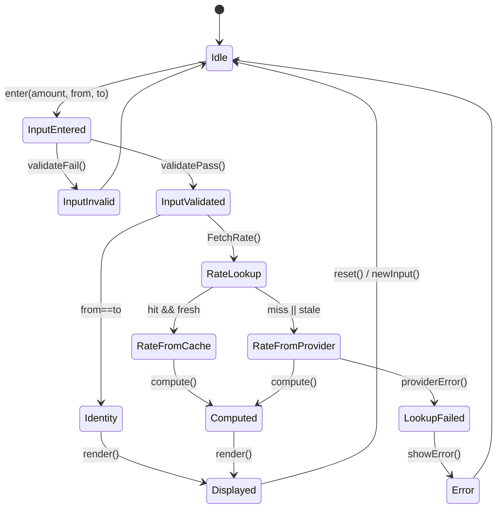

# Currency Converter State Diagram



This state diagram represents the flow of a currency converter application with the following key states:

- **Idle**: Initial state waiting for user input
- **InputEntered**: User has entered amount and currency types
- **InputValidated**: Input has passed validation
- **Identity**: Special case where source and target currencies are the same
- **RateLookup**: Fetching exchange rate
- **RateFromCache**: Using cached rate data
- **RateFromProvider**: Fetching fresh rate from external provider
- **Computed**: Conversion calculation complete
- **Displayed**: Result shown to user
- **Error**: Error state for failed lookups

---

## Currency Converter Flowchart

```mermaid
flowchart TD
  S([Start]) --> V{Valid input? (amount>0, supported codes)}
  V -- No --> ERR[Show validation error] --> Idle([Idle])
  V -- Yes --> Same{from == to?}
  Same -- Yes --> Identity[Return amount unchanged] --> Disp[Display result + timestamp + source] --> Next{Reset / New input?} -->|Yes| S
  Same -- No --> Hit{Cache hit & fresh?}
  Hit -- Yes --> Compute[Compute amount × rate] --> Disp
  Hit -- No --> Fetch[Fetch base rates from provider] --> Derive[Derive pair rate] --> Cache[Update cache] --> Compute --> Disp
  Fetch -.fail.-> ProvErr[Provider error] --> ERR --> Idle
  Disp -- No --> End([End])
```

This flowchart shows the detailed process flow with the following key paths:

- **Input Validation**: Checks if amount > 0 and currency codes are supported
- **Identity Conversion**: Direct passthrough when source and target currencies match
- **Cache Strategy**: Attempts to use cached rates if available and fresh
- **Rate Fetching**: Calls external provider when cache miss or stale data
- **Error Handling**: Gracefully handles provider errors and validation failures
- **Computation**: Applies exchange rate calculation
- **Display**: Shows result with timestamp and source information
- **Loop**: Allows user to perform additional conversions or exit

---

## Authentication State Diagram

```mermaid
stateDiagram-v2
  [*] --> LoggedOut

  LoggedOut --> Authenticating: submitCredentials() / audit("login_attempt")
  Authenticating --> LoggedIn: verifyPass && mfaPass / issueToken(); setRole(); updateLastActivity()
  Authenticating --> LoggedOut: verifyFail / loginAttempts++; audit("login_failed")
  Authenticating --> Locked: loginAttempts >= 3 / notifySecurity(); audit("account_locked")

  LoggedIn --> LoggedIn: activity() [tokenValid && rolePermits(action)] / updateLastActivity(); audit("action")
  LoggedIn --> SessionExpired: timeout(now - lastActivity > SESSION_TIMEOUT) / revokeToken(); audit("session_expired")
  LoggedIn --> LoggedOut: logout() / revokeToken(); audit("logout")

  SessionExpired --> Authenticating: reauth() / audit("reauth")
  Locked --> PasswordReset: requestReset() / audit("password_reset_requested")
  PasswordReset --> LoggedOut: resetComplete() / loginAttempts = 0; audit("password_reset_complete")

  note right of LoggedIn
    Variables:
      - loginAttempts (int)
      - sessionToken (string)
      - userRole (enum)
      - lastActivity (timestamp)
      - mfaRequired (bool)
    Guards:
      - verifyPass, mfaPass
      - tokenValid
      - rolePermits(action)
      - now - lastActivity <= SESSION_TIMEOUT
  end note
```



This authentication state diagram represents a secure user authentication flow with the following key features:

- **LoggedOut**: Initial state, user not authenticated
- **Authenticating**: Credentials being verified (password + MFA)
- **LoggedIn**: Active authenticated session with token
- **SessionExpired**: Session timeout due to inactivity
- **Locked**: Account locked after failed login attempts
- **PasswordReset**: Password recovery flow

Key security features:
- **Multi-factor Authentication (MFA)**: Requires both password and MFA verification
- **Login Attempt Tracking**: Locks account after 3 failed attempts
- **Session Management**: Automatic timeout based on inactivity
- **Audit Logging**: All authentication events are logged
- **Token-based Authentication**: Issues and validates session tokens
- **Role-based Access Control**: Checks permissions for each action
- **Security Notifications**: Alerts sent on account lock events
